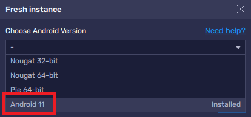
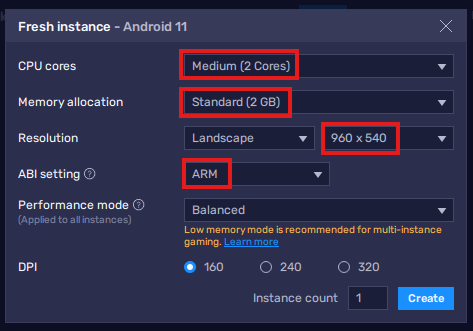
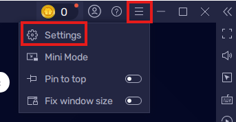
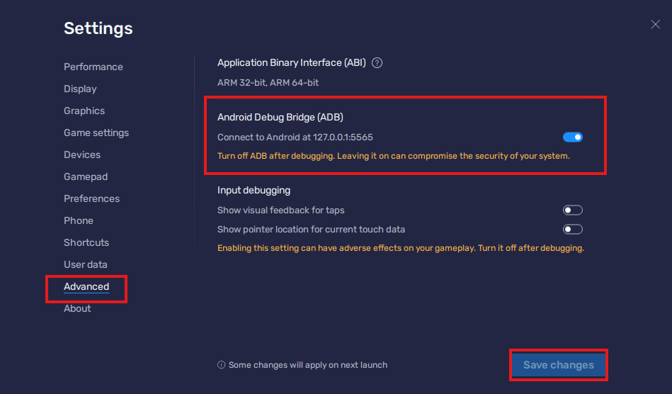
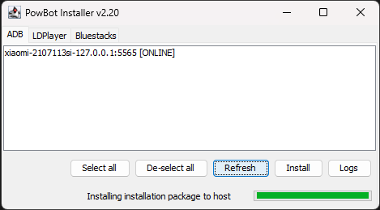
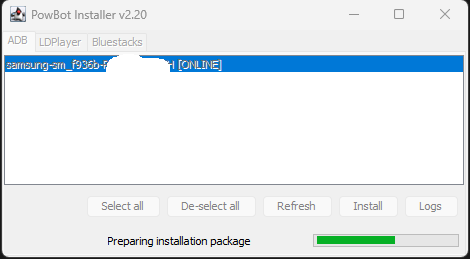
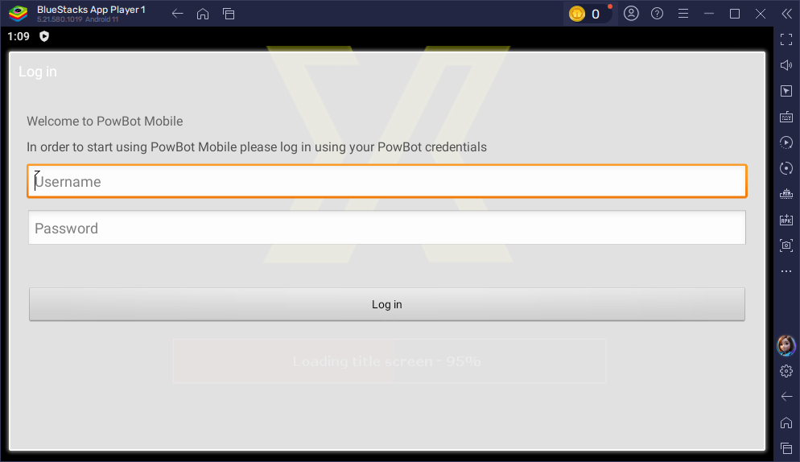

# Installing PowBot on a Bluestacks 5 instance

Please ensure you have met the requirements in the [requirements](../install/index.md) page before following the steps below.

This guide will cover installing bluestacks, creating a new instance and installing PowBot on it.

## Step 1 - Download and run the PowBot Installer

The link to download the PowBot Installer can be found in our discord server, in the ['Downloads and setup'](https://discordapp.com/channels/341014842745815054/976860980187390072) channel.

Once downloaded, run the installer by double clicking it. Accept any terms and conditions that may appear.

* Please note that the installer might take a while to load on slower machines/connections, please be patient.

Once the installer has loaded, you will see the following screen:


{: style="height:250px"}


## Step 2 - Download and install Bluestacks 5

Download and install Bluestacks 5 from the [official website](https://www.bluestacks.com/download.html).

* Please ensure you download Bluestacks 5, not Bluestacks 4 and not Bluestacks X.

## Step 3 - Create a new instance

Bluestacks allows you to create multiple instances on the same machine. This is useful if you want to have multiple clients open at the same time.

Start by opening the Bluestacks Multi-instance Manager.

{: style="height:250px"}

Next, click on the `Instance` button at the bottom left.

{: style="height:450px"}

Always select `Fresh Instance` when creating a new instance. This will ensure that your instance is reset to a clean state and not directly linked to any previous instances.

{: style="height:200px"}

Select `Android 11` as the Android version.

{: style="height:200"}

On the next screen, ensure the following settings are selected:

- CPU Cores: Recommended is `2`
- Memory allocation: Recommended is `2GB`
- Resolution: Recommended is `960x540`
- ABI Settings: `ARM`

{: style="height:350px"}

## Step 5 - Start instance and enable developer options.

You should see a new instance appear in the list. Start the instance by clicking on the `Start` button.

{: style="height:175px"}

Once it has loaded, go to the instance settings by clicking on the hamburger menu in the top right and selecting `Settings`.

{: style="height:200px"}

Next, go the the `Advanced` tab, enable `Android Debug Bridge (ADB)`  

Please note down the address shown. In this case, it is `127.0.0.1:5565`.

Click on `Save changes`

{: style="height:450px"}


## Step 4 - Connect to the instance via ADB.

Open a command prompt window and run the commands below by copying and pasting them, and pressing enter after each one.

```
cd %userprofile%\.powbot\android\platform-tools\
```

```
adb.exe connect 127.0.0.1:5565
```

Ensure that the address matches the one you noted down in the previous step.


The window should look similar to this if everything was successful:

{: style="height:150px"}


## Step 5 - Install PowBot

Go back to the installer and under the `ADB` tab, click the 'Refresh' button. You should see your instance appear in the list with an `[ONLINE]` tag next to it.

{: style="height:250px"}

Select it and click on the `Install` button. When prompted for what version to install. You're free to pick either.

* Release: The latest stable version of PowBot. This is usually the most stable version of the client to use.
* Beta: The latest beta version of PowBot. This may have new features that are not yet available in the release version, but may also have bugs.

{: style="height:250px"}

Now sit back and wait for the installation to complete. Once done, you will see the game open up on your instance followed shortly by the PowBot Login screen.


{: style="height:350px"}


